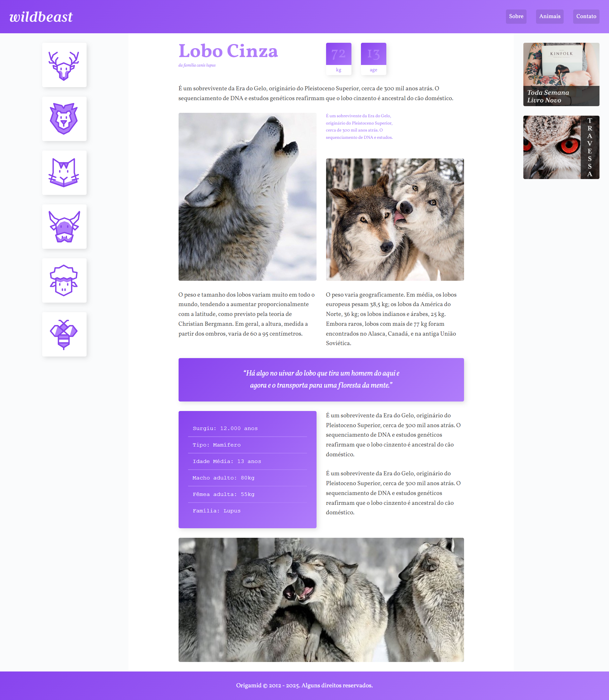

# 🐺 Wildbeast – Curso Origamid

Projeto desenvolvido como parte do curso **[CSS Grid Layout](https://www.origamid.com/curso/css-grid-layout)** da Origamid.  
O **Wildbeast** é um site fictício que serviu para aplicar praticamente todas as propriedades do **CSS Grid Layout**, desde a criação de colunas e linhas até layouts responsivos completos.

---

## 🚀 Preview  
🔗 [Acesse o projeto online aqui](https://thur-code.github.io/wildbeast-origamid/)

 

---

## 🛠 Tecnologias utilizadas

- **HTML5** (estrutura semântica)
- **CSS3** com foco em **Grid Layout**
- Responsividade com **media queries**

---

## 🎯 Conceitos aplicados  
Durante a construção do projeto foram trabalhados:

🔹 **Fundamentos do Grid**

- `display: grid`
- Definição de colunas e linhas (`grid-template-columns`, `grid-template-rows`)
- Áreas nomeadas (`grid-template-areas`)
- `grid-gap`, `grid-auto-flow`, `grid-auto-columns`, `grid-auto-rows`

🔹 **Alinhamento e posicionamento**

- `justify-content`, `align-content`
- `justify-items`, `align-items`
- `justify-self`, `align-self`

🔹 **Projeto Wildbeast**

- Estruturação completa com **Grid**
- Criação de layout principal (header, menu lateral, conteúdo, anúncios e footer)
- Seções de conteúdo dinâmico (texto, imagens, atributos e características do animal)
- Responsividade do grid, com ajustes para diferentes tamanhos de tela

---

## 📂 Status

✅ Concluído

---

## 📝 Observações  
- Projeto feito de forma guiada durante as aulas do curso Origamid.  
-O design e o código foram mantidos próximos ao exemplo do professor, com o objetivo de consolidar os fundamentos de CSS Grid Layout.
